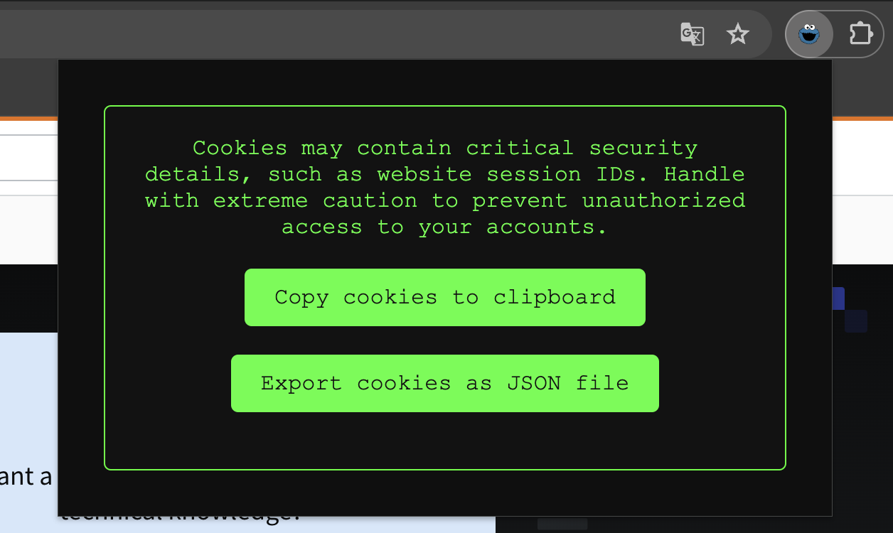

# Export Cookie for Puppeteer - Enhanced

This project is a fork of the [ktty1220/export-cookie-for-puppeteer](https://github.com/ktty1220/export-cookie-for-puppeteer) extension. It has been enhanced with an improved UI design, a new icon, and the added feature to save cookies directly to the clipboard.

## Preview

## Features

- Export cookies from the current page to a JSON file
- Copy cookies from the current page to the clipboard
- Improved UI design
- New icon

## Usage

Click on the extension icon to save the cookies from the current page as a JSON file or copy them to the clipboard.

## Installation

As this extension is not available on the Chrome Web Store or Firefox Add-ons, you will need to install it manually.

### Chrome

1. Download the source code and extract it to a known location on your computer.
2. Open Chrome and navigate to `chrome://extensions`.
3. Enable "Developer mode" by clicking the toggle switch in the top right corner.
4. Click "Load unpacked" and select the directory containing the extension's source code.

### Firefox

1. Download the source code and extract it to a known location on your computer.
2. Open Firefox and navigate to `about:debugging`.
3. Click "This Firefox" in the left sidebar.
4. Click "Load Temporary Add-on..." and select any file in the directory containing the extension's source code.

Please note that this will only load the extension temporarily, and it will be removed when you close Firefox. To keep the extension permanently, you would need to package it into a .xpi file and submit it to Mozilla for signing.

## Credits

[ktty1220/export-cookie-for-puppeteer](https://github.com/ktty1220/export-cookie-for-puppeteer).
